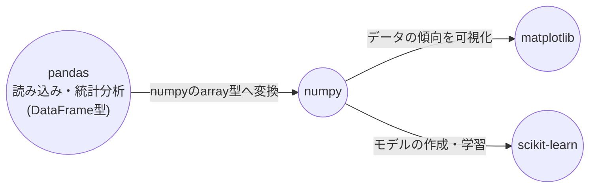

## 単回帰分析とは

単回帰は教師あり学習のひとつで, 1つの説明変数から目的変数を予測する手法です.\
回帰は目的変数が連続値である予測が出来た場合に用いられます.

## 使用するライブラリ

- **pandas**\
  数表を扱うライブラリ.
- **numpy**\
  行列計算をするためのライブラリ.
- **scikit-learn**\
  学習のためのモデルやデータを扱うライブラリ.
- **matplotlib**\
  グラフを作成するためのライブラリ.

## ライブラリの使用Flow

> [!NOTE] pandasのDataFrame型をnumpyのarray型に変換してから matplotlib や scikit-learn
> 等のモジュールで使用する.

## 分析Flow

大雑把な分析の流れです.

1. pandasでデータを読み込む
2. 標準化する
3. pandasで相関係数を見る
4. matplotlibでデータの傾向を見る
5. データの分割
6. scikit-learnで線形回帰モデルを作る
7. 学習させる
8. モデルの性能を評価する

> [!NOTE] 2で説明変数と目的変数に直線的な関係がなかったり, 3で相関があまりなかった場合は線形回帰はできない.

## 終わりに

今回は, 単回帰分析の全体的なFlowについて書きました.\
細かい解説や実装方法はまた別の記事に書こうと思います.(まだ理解してないなんていえない)
