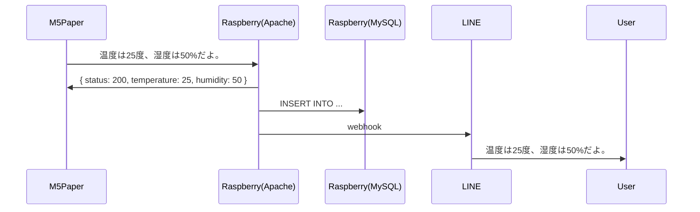

概要図をMermaid記法で記述する。

```mermaid,autorun
sequenceDiagram
  participant M5 as M5Paper
  participant R as Raspberry(Apache)
  participant RD as Raspberry(MySQL)
  participant LINE
  participant User
  M5->>R: 温度は25度、湿度は50%だよ。
  R->>M5: { status: 200, temperature: 25, humidity: 50 }
  R->>RD: INSERT INTO ...
  R->>LINE: webhook
  LINE->>User: 温度は25度、湿度は50%だよ。
```
