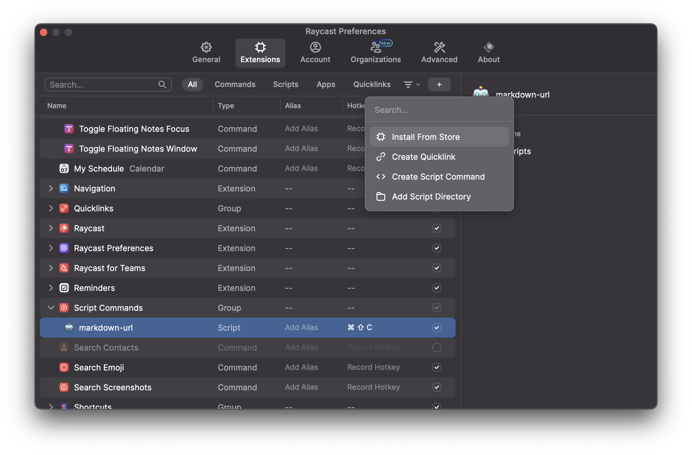

## 初めに
RaycastのショートカットとAppleScriptを使ってChromeのURLをマークダウン形式で取得するスクリプトを作成します。



## AppleScript

```
#!/usr/bin/osascript

# Required parameters:
# @raycast.schemaVersion 1
# @raycast.title markdown-url
# @raycast.mode silent

# Optional parameters:
# @raycast.icon 🤖

tell application "Google Chrome" to set currentTabUrl to URL of active tab of window 1
tell application "Google Chrome" to set currentTabTitle to title of active tab of window 1

set link to "[" & currentTabTitle & "]" & "(" & currentTabUrl & ")"

set the clipboard to link

log link
```

